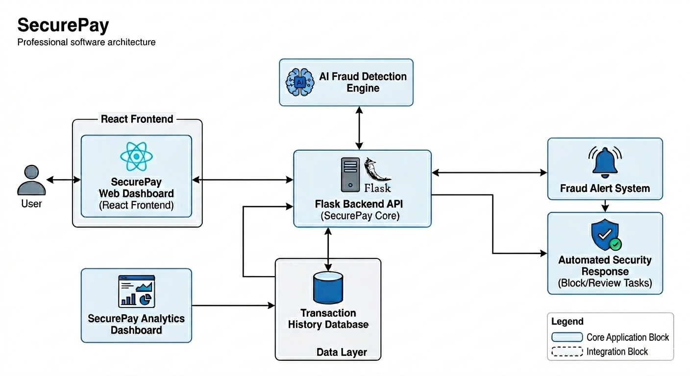
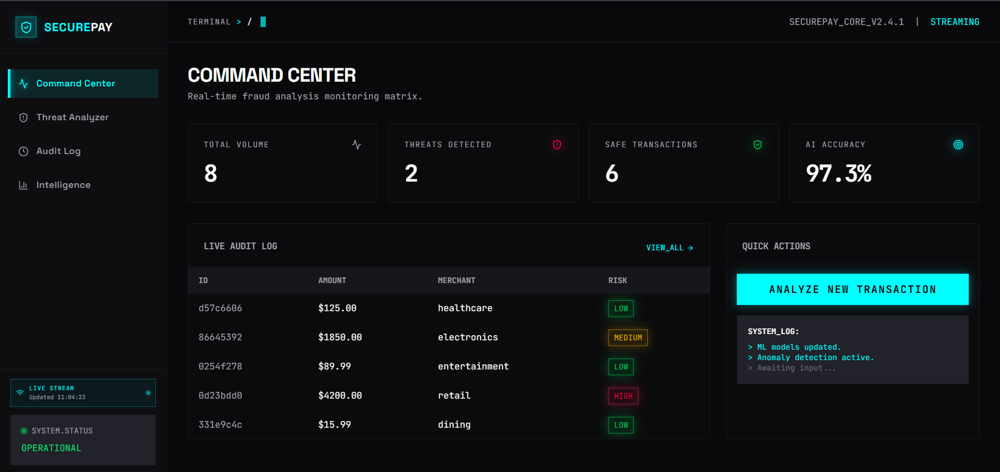
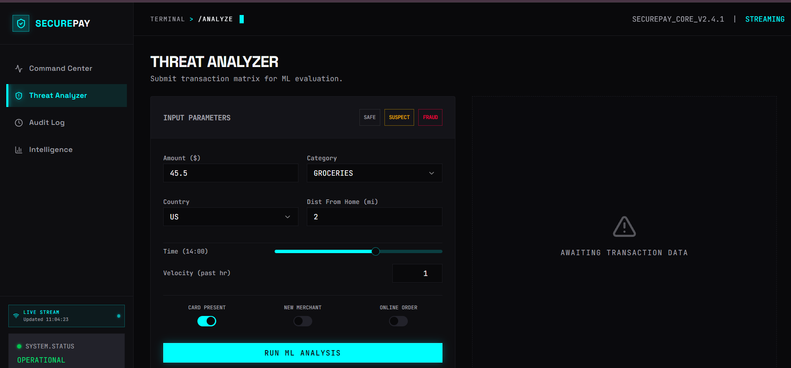
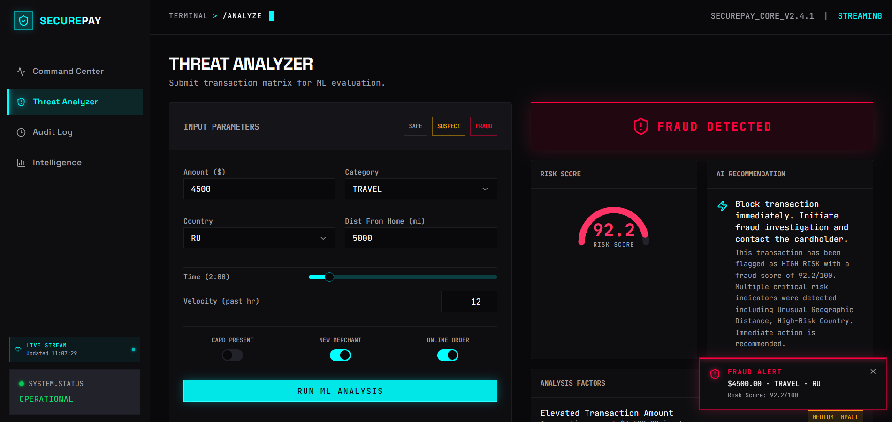
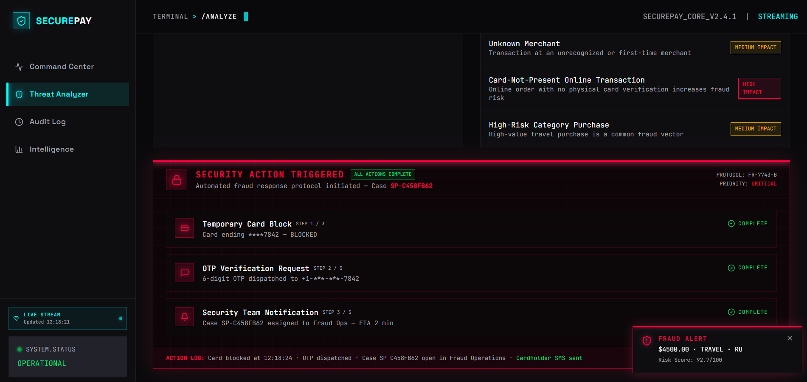
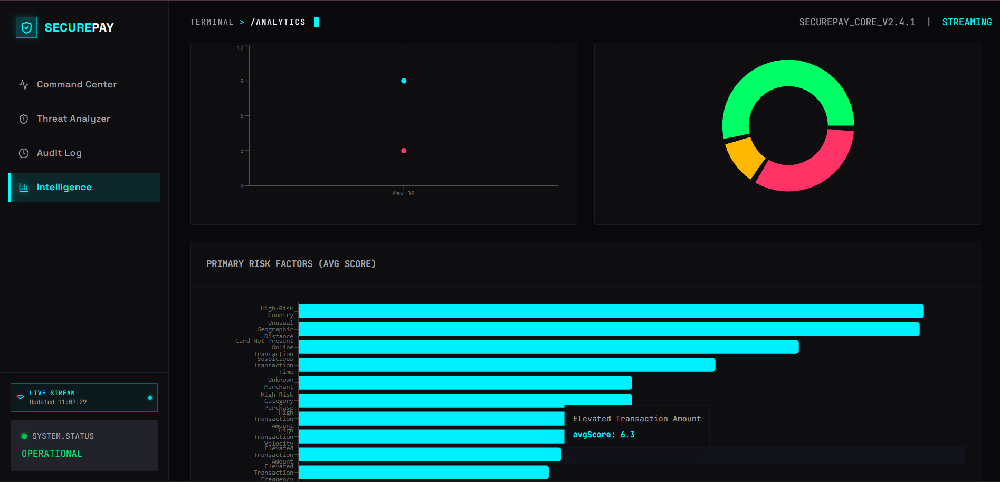

# 🛡️ SecurePay

### AI-Powered Fraud Detection & Real-Time Transaction Monitoring

Detect suspicious transactions instantly using Machine Learning, dynamic risk scoring, and automated security response systems.

🚀 **Developed by Team Nexora**

---

# 👥 Team Members

* Shaik Basheer Unnisa
* Yalala Manisha

---

# 📌 Product Overview

SecurePay is an AI-powered fraud detection platform designed to identify suspicious financial transactions in real time using Machine Learning and behavioral pattern analysis.

The system evaluates transaction characteristics such as:

* Transaction Amount
* Transaction Category
* User Behavior Patterns
* Transaction Risk Factors
* Historical Transaction Activity

SecurePay generates:

* Fraud Detection Results
* Dynamic Risk Scores
* Fraud Alerts
* Automated Security Responses
* Real-Time Monitoring Insights

The platform helps improve digital payment security, reduce fraud risks, and strengthen trust in online financial systems.

---

# ✨ Key Highlights

🔍 AI-Powered Fraud Detection

📊 Dynamic Risk Scoring

🚨 Real-Time Fraud Alerts

🛡️ Automated Security Response

📈 Analytics Dashboard

⚡ Fast Transaction Analysis

🧾 Transaction History Tracking

🔐 Improved Digital Payment Security

---

# 🌍 UN SDG Alignment

## SDG 9 – Industry, Innovation and Infrastructure

SecurePay promotes innovation in financial technology by integrating Artificial Intelligence into digital transaction security systems.

## SDG 16 – Peace, Justice and Strong Institutions

SecurePay contributes to safer digital financial ecosystems by helping prevent fraudulent activities and strengthening trust in digital transactions.

---

# 🎯 Problem Statement

Online payment systems are increasingly vulnerable to fraudulent transactions, cyber threats, and financial abuse.

Many existing systems either fail to detect fraud in real time or lack clear explanations for suspicious activities.

This creates financial losses, operational risks, and reduced customer trust.

---

# 💡 Solution

SecurePay combines Artificial Intelligence and transaction analysis techniques to identify suspicious financial activities instantly.

The platform:

* Detects abnormal transaction behavior
* Generates dynamic fraud risk scores
* Provides fraud alerts
* Simulates automated security responses
* Supports transaction monitoring and analytics

This enables smarter and faster fraud detection while improving digital payment security.

---

# 🧠 Tech Stack

## Frontend

* React
* TypeScript
* Tailwind CSS

## Backend

* Python
* Flask

## Machine Learning

* Scikit-learn
* Pandas
* NumPy

## Data Visualization

* Interactive Dashboard
* Analytics Components

---

# ⚙️ Key Features

✅ Real-Time Fraud Detection

✅ Dynamic Risk Scoring

✅ AI-Based Transaction Analysis

✅ Fraud Alert Generation

✅ Automated Security Response

✅ Card Block Simulation

✅ OTP Verification Simulation

✅ Security Notification System

✅ Transaction History Tracking

✅ Analytics Dashboard

---

# 🔄 System Workflow

1. User enters transaction details.
2. SecurePay processes the transaction data.
3. AI Fraud Detection Engine analyzes the transaction.
4. Fraud probability and risk score are generated.
5. Fraud alerts are triggered for suspicious transactions.
6. Automated security actions are executed.
7. Results are displayed through the dashboard and analytics system.

---

# 🏗️ System Architecture

The SecurePay architecture integrates a React-based frontend, Flask backend services, AI-powered fraud detection, transaction monitoring, and automated security response mechanisms.



---

# 💻 Installation Guide

## Clone Repository

```bash
git clone https://github.com/your-username/SecurePay.git
```

## Navigate into Project Folder

```bash
cd SecurePay
```

## Install Dependencies

```bash
npm install
```

## Run Frontend

```bash
npm run dev
```

## Run Backend

```bash
python app.py
```

Open the application in your browser.

---

# 📸 Product Gallery

## 🖥️ Command Center Dashboard

Real-time monitoring dashboard displaying transaction statistics, fraud metrics, and operational insights.



---

## 🔎 Threat Analyzer

Analyze transaction details and generate AI-powered fraud predictions.



---

## 🚨 Fraud Detection Results

Risk scoring and fraud probability generation for suspicious transactions.



---

## 🛡️ Automated Security Response

Simulated card blocking, OTP verification, and security notification workflow.



---

## 📊 Analytics Dashboard

Visual insights, transaction monitoring, and fraud intelligence analytics.



---

# 📊 Impact

SecurePay helps:

* Reduce financial fraud risks
* Improve trust in digital payment systems
* Strengthen cybersecurity awareness
* Support intelligent fraud monitoring
* Improve transaction transparency
* Enable data-driven decision making

---

# 🌍 Why SecurePay Matters

As digital payments continue to expand globally, fraud prevention has become a critical challenge for businesses and financial institutions.

SecurePay demonstrates how Artificial Intelligence can be applied to improve financial security through intelligent transaction analysis, fraud detection, and automated response systems.

---

# 🔮 Future Enhancements

* Real Payment Gateway Integration
* SMS & Email Alert Services
* Mobile Application Support
* Advanced Behavioral Analytics
* Multi-Bank Monitoring Dashboard
* Enhanced Machine Learning Models
* Cloud Deployment Support

---

# 🏆 Project Outcome

SecurePay demonstrates the practical application of Artificial Intelligence, cybersecurity concepts, and software engineering principles to create a secure and intelligent fraud detection platform.

The project combines real-time monitoring, AI-driven risk analysis, and automated response mechanisms to help improve the safety of digital financial transactions.

---

# 🚀 Team Nexora

### Making Digital Payments Safer with AI Intelligence
